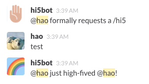

### Features

* Only needs an incoming hook and a custom command!
* You can high-five anybody in the room with `/hi5` ...
* ... or target someone specifically `/hi5 hermione` ...
* or even high-five yourself.
* Watch out, though! People might steal that high-five if Hermione isn't fast enough.

### Setup

Create an Incoming Hook and note the token. Write the token down in a `token` file.

```
cabal sandbox init
cabal install --only-dependencies -j
cabal run
```

This will launch an HTTP server that listens to port 81.

Create a Custom Command (like `/hi5`) and point it at the HTTP server.

Now, should you type `/hi5`, you'll get this:


